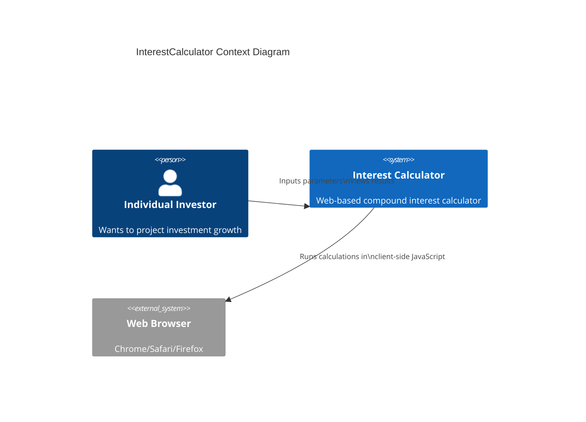

## 1.1 InterestCalculator - Planning - Briefing

> `1_1.InterestCalculator_planning_briefing.md`

**InterestCalculator** is a web-based financial calculator for personal use to generate detailed tables showing future investment values. Its core functionality includes accurate compound interest calculations and customizable scenario comparisons.

## Features:

### Must have features:

1. `CompoundInterestCalculation`
   - Daily/monthly/quarterly/annual compounding options
   - Principal amount input with currency formatting
   - Annual interest rate percentage input

2. `TableGeneration`
   - Year-by-year growth visualization
   - Export to CSV functionality
   - Increment and accumulated values

### Nice to have features:

3. `Export`
   - Export to CSV functionality

4. `Graph`
   - Graphical growth curve overlay

### Won't-Have Features:
- Tax calculation integration
- Inflation rate adjustments
- Stock market investment simulations

## Specifications

### Must have

1. `MobileOptimization`
   - Touch-friendly table controls
   - Offline calculation capability
  
### Nice to have

2. `CalculationAccuracy`
   - IRS-compliant compound interest formulas
   - Decimal precision to 4 places

3. `Performance`
   - <500ms response time for 50-year projections
   - Client-side computation only

### Won't-Have
- Bank-grade security compliance
- Multi-user accounts
- Cloud storage of results

## System Diagram

