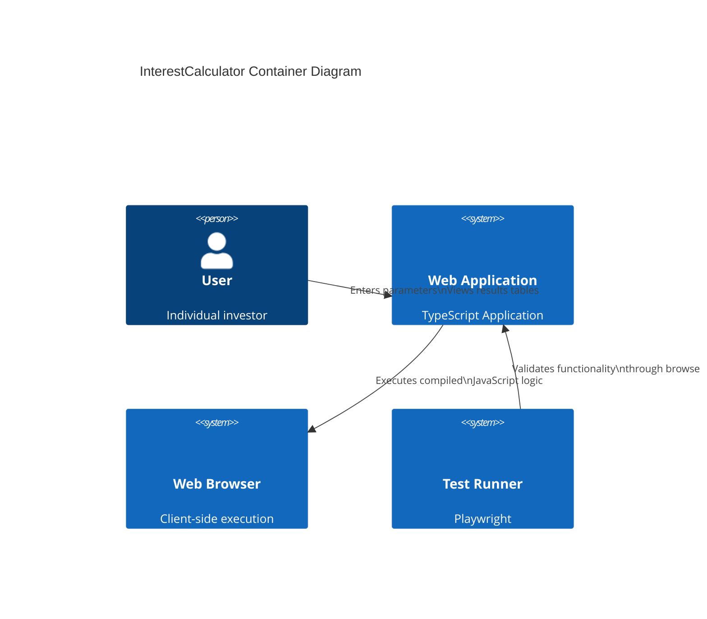

# 2.1 InterestCalculator - Analysis - System Architecture

> `2_1.InterestCalculator_analysis_system-architecture.md`

This document outlines the system architecture for the **InterestCalculator** application, providing client-side compound interest calculations with export capabilities.

## System Overview

The solution will consist of the following key **components**:

### Front end 
- Zero-dependency web application with vanilla TypeScript
- Tech stack:
  - Language: TypeScript 5.0+
  - Framework: None (vanilla DOM manipulation)
  - Tools: Vite + TypeScript compiler
  - Testing: Playwright E2E tests, ESLint static analysis

### Back end 
- Not required (pure client-side application)
- Tech stack: N/A

### Database 
- No persistent storage required
- Type: In-memory data storage during session

### Security : 
- Client-side data isolation (no server transmission)
- XSS protection for dynamic content
- HTTPS enforcement for deployment

### Integrations : 
- CSV export via FileSaver.js
- PDF generation using jspdf
- No third-party API dependencies

### Deployment
- Static hosting via GitHub Pages
- CI/CD: GitHub Actions with Playwright test suite
- Cache-control headers for asset versioning

## System Diagram

