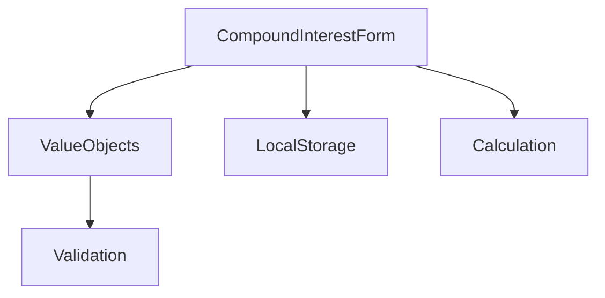

# Project Overview

## Architecture



## Dependencies

### Production
- No runtime dependencies

### Development
- TypeScript 5.0+
- Vite 4.0+
- Playwright 1.40+
- PicoCSS 2.0+

## Folder Structure

```
├── src/
│   ├── components/
│   │   └── CompoundInterestForm.ts
│   ├── domain/
│   │   └── valueObjects/
│   ├── utils/
│   │   └── calculation.ts
│   └── main.ts
├── tests/
│   └── e2e/
├── docs/
└── public/
```

## Key Design Decisions

1. No external dependencies to keep the bundle size minimal
2. Value Objects for robust validation
3. TypeScript for type safety
4. PicoCSS for minimal styling with good defaults 