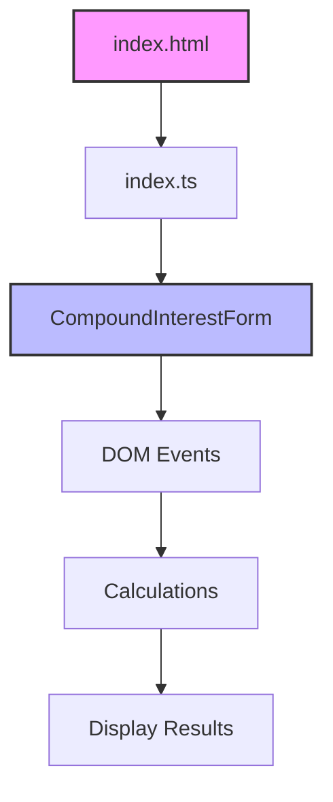

# Project Overview

## Tech Stack

### Core Technologies
- TypeScript
- Vite (Build tool)
- Bun (Runtime & Package Manager)
- PicoCSS (Styling)

### Testing
- Playwright (E2E Testing)

## Dependencies

```json
{
  "dependencies": {
    "picoCss": "latest"
  },
  "devDependencies": {
    "typescript": "^5.x",
    "vite": "^5.x",
    "playwright": "^1.x",
    "@playwright/test": "^1.x"
  }
}
```

## Project Structure

```
.
├── src/
│   ├── components/
│   │   └── CompoundInterestForm.ts
│   ├── style.css
│   └── index.ts
├── tests/
│   └── e2e/
├── docs/
│   ├── project-overview.md
│   └── journal.md
├── index.html
└── package.json
```

## Architecture



## Key Design Decisions

1. **Component-Based Architecture**
   - Modular components for better maintainability
   - Each component handles its own state and events

2. **Type Safety**
   - Strict TypeScript configuration
   - Value objects for data validation

3. **Testing Strategy**
   - E2E tests with Playwright
   - Focus on user interaction flows

4. **Styling Approach**
   - PicoCSS for minimal, semantic styling
   - CSS variables for theming
   - Responsive design principles 